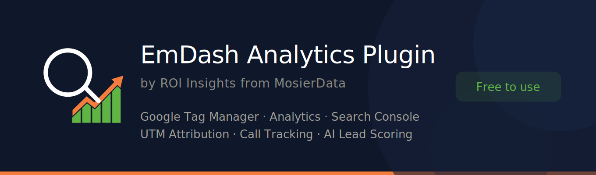

<p align="center">
  
</p>

# EmDash Analytics Plugin

**Tag management, tracking pixels, analytics, and call tracking for EmDash CMS — provided by [ROI Insights](https://roiknowledge.com/?utm_source=github&utm_medium=referral&utm_campaign=emdash-analytics) from [MosierData](https://mosierdata.com/?utm_source=github&utm_medium=referral&utm_campaign=emdash-analytics).**

Native one-toggle setup for Google Tag Manager, GA4, Meta Pixel, LinkedIn, TikTok, Microsoft Ads, Pinterest, and Nextdoor — plus call tracking, custom script injection, and an embedded analytics dashboard.

Core features are completely free — just register for a free license key (no credit card required). Premium upgrades are available when you're ready for AI-powered call analysis, lead scoring, and advanced attribution.

[](LICENSE)
[](https://github.com/emdash-cms/emdash)
[](https://www.typescriptlang.org/)

---

## The Problem

You just launched your EmDash site. You need Google Analytics. You need your Meta Pixel. Maybe you're running Google Ads and need Tag Manager wired up. You go looking for a way to add tracking scripts — and there isn't one. EmDash is brand new, and tag management, analytics integration, and call tracking simply aren't built in yet.

If you're spending money on marketing, that's not a minor inconvenience. Every day without tracking is a day you're paying for traffic you can't measure.

## The Fix

Install this plugin. In about 60 seconds, you'll have Google Tag Manager injecting into your `<head>` and `<body>`, Google Analytics 4 connected via one-click OAuth, and native toggles for six major ad platforms — Meta, LinkedIn, TikTok, Microsoft, Pinterest, and Nextdoor — each with built-in setup guides so you never have to leave your admin panel.

And if your business depends on phone calls, you can provision a call tracking number right from your EmDash admin. No separate vendor accounts. No code. Just a tracking number that tells you exactly which ad, campaign, or page made the phone ring.

**That's what this plugin does. And the core of it is free.**

---


## What's Included for Free

This isn't a demo and it doesn't expire. These features are yours to keep.

### Google Tag Manager Injection
Enter your GTM container ID and the plugin handles the rest — `<head>` script, `<body>` noscript fallback, automatic injection on every page. **You get proper tag management on your EmDash site** without editing a single template file.

### Google Analytics 4 (Native Toggle)
Enable GA4 with a single toggle and your Measurement ID — the plugin handles the script injection automatically. Then connect your GA4 property through one-click Google OAuth to see **sessions, active users, traffic sources, and lead data** right inside your EmDash admin. No more logging into a separate analytics dashboard just to check if your traffic went up.

### Google Search Console Connection
Link your Search Console property the same way. **You get clicks, impressions, CTR, and average position** for your top queries and pages, all in one dashboard alongside your other metrics.

### Native Ad Platform Tracking Pixels
Six major advertising platforms have dedicated toggles with built-in setup guides — no code, no copy-paste, no guessing which script goes where:

| Platform | What It Does |
|----------|-------------|
| **Meta (Facebook) Pixel** | Tracks conversions from Facebook and Instagram ads, builds retargeting audiences from your visitors, and helps Meta find more people like your best customers |
| **LinkedIn Insight Tag** | Measures conversions from LinkedIn ads and unlocks Website Demographics — see the job titles, industries, and company sizes of your visitors. Essential for B2B |
| **TikTok Pixel** | Tracks conversions from TikTok ads and lets the algorithm optimize toward people who actually become leads — not just clickers |
| **Microsoft (Bing) UET Tag** | Enables conversion tracking and remarketing for Microsoft Advertising across Bing, Yahoo, DuckDuckGo, and partner sites. Often the cheapest cost-per-lead in paid search |
| **Pinterest Tag** | Tracks conversions from Promoted Pins and builds audiences for Pinterest campaigns. Especially valuable for visual businesses (renovation, landscaping, design) |
| **Nextdoor Pixel** | Tracks conversions from Nextdoor neighborhood ads — hyper-local targeting for home services, contractors, and any business that serves a specific area |

Each platform includes an expandable help panel explaining what the pixel does, why you'd use it, when to skip it (e.g., if you're already loading it through GTM), and step-by-step instructions for finding your tracking ID.

### Header & Footer Script Injection
Running a platform we don't have a native toggle for? Hotjar, Clarity, CallRail, or anything else? Paste the snippet into the header or footer code fields. **If it's a tracking script, you can add it here** — no developer required.

### Call Tracking
Provision a local or toll-free tracking number directly from your EmDash admin panel. Calls forward to your real business number instantly. **You know exactly which marketing channel, campaign, or keyword drove each call** — no guessing, no asking "how'd you hear about us?"

### Basic Call Log
Every inbound call is logged with caller ID, duration, timestamp, and the attributed marketing source. **You get a clean record of every lead that came in by phone** and what brought them there.

---


## Premium Upgrades (Optional)

The free tier stays free forever. Paid tiers add AI-powered intelligence and deeper attribution for businesses that want to know more than just *that* a lead came in — they want to know whether it was any good.

| Feature | Free | Professional | Business |
|---------|:----:|:------------:|:--------:|
| | | **$39.95/mo** | **$199/mo** |
| GTM injection | ✅ | ✅ | ✅ |
| GA4 + Search Console | ✅ | ✅ | ✅ |
| Native ad pixels (Meta, LinkedIn, TikTok, Bing, Pinterest, Nextdoor) | ✅ | ✅ | ✅ |
| Header/footer scripts | ✅ | ✅ | ✅ |
| Call tracking provisioning | ✅ | ✅ | ✅ |
| Basic call log | ✅ | ✅ | ✅ |
| Call tracking rate (per number/month) | $15.00 | $9.00 | $6.00 |
| Call tracking rate (per minute) | $0.25 | $0.15 | $0.10 |
| AI weekly executive summary | — | ✅ | ✅ |
| Call audio recording | — | ✅ | ✅ |
| AI call transcription & scoring | — | ✅ | ✅ |
| Advanced UTM attribution | — | ✅ | ✅ |
| Ads Advisor (24/7 spend watchdog) | — | — | ✅ |
| Custom reporting | — | — | ✅ |
| MCP AI agent access | — | — | ✅ |

**Professional ($39.95/mo)** is built for businesses running paid ads. You get a weekly AI executive summary that tells you what's working, full call transcription and lead scoring, and lower call tracking rates. For a lot of businesses, the savings on call tracking alone covers the subscription — see the math below.

**Business ($199/mo)** is for high-volume advertisers and agencies. The Ads Advisor watches your Google Ads spend around the clock — alerting you to budget overruns, underperforming campaigns, and automated bidding changes that are quietly costing you money. You also get the lowest call tracking rates, custom reporting, and MCP AI agent access to query your marketing data programmatically.

**Founder's Club ($4,495 one-time)** — Lifetime access to Business tier features, available as a limited-time offer for early adopters. See [ROI Insights](https://roiknowledge.com/?utm_source=github&utm_medium=referral&utm_campaign=emdash-analytics) for availability.

### Does upgrading actually save money?

It can — and often does. Because call tracking rates drop with higher tiers, the subscription frequently pays for itself in reduced telecom costs alone.

**Small business running 120 calls/month (avg. 3 min each, 1 tracking number):**

| | Platform | Number | Minutes | Monthly Total |
|--|:--------:|:------:|:-------:|:-------------:|
| Free | $0 | $15.00 | $90.00 | **$105.00** |
| Professional | $39.95 | $9.00 | $54.00 | **$102.95** |

At 120 calls a month, Professional is cheaper than Free — and includes AI transcription, lead scoring, and weekly reports.

**Agency running 15 numbers, 3,000 minutes/month:**

| | Platform | Numbers | Minutes | Monthly Total |
|--|:--------:|:-------:|:-------:|:-------------:|
| Professional | $39.95 | $135.00 | $450.00 | **$624.95** |
| Business | $199.00 | $90.00 | $300.00 | **$589.00** |

The jump from Professional to Business saves $35/month in telecom costs alone, plus adds the Ads Advisor and custom reporting.

---


## Quick Start

### Step 1 — Install the Plugin

From your EmDash project directory, install the package:

```bash
npm install @mosierdata/emdash-plugin-analytics
```

### EmDash 0.1.x — Apply the KV Patch

If you're running EmDash **0.1.x**, the analytics plugin requires KV helpers (`getRaw`, `commitIfValueUnchanged`) that aren't in the stock release yet. Apply the included patch at **your site's repo root** (not inside the plugin):

```bash
npm install patch-package --save
mkdir -p patches
cp node_modules/@mosierdata/emdash-plugin-analytics/patches/emdash+0.1.0.patch patches/
npx patch-package
```

Then add a `postinstall` script to your site's `package.json` so the patch re-applies on every install:

```json
"scripts": {
  "postinstall": "patch-package"
}
```

> This step won't be needed once EmDash ships these KV APIs natively. See [TROUBLESHOOTING.md](TROUBLESHOOTING.md) for details.

### Step 2 — Register the Plugin

Add the plugin to your `astro.config.mjs`:

```js
import { defineConfig } from "astro/config";
import emdash from "emdash/astro";
import roiInsights from "@mosierdata/emdash-plugin-analytics/descriptor";

export default defineConfig({
  integrations: [
    emdash({
      plugins: [roiInsights()],
    }),
  ],
});
```

### Step 3 — Deploy and Configure

Build and deploy your site, then open the EmDash admin panel. The plugin adds three tabs:

| Tab | What You'll Do There |
|-----|---------------------|
| **License & Google** | Enter your license key (required — free keys are available), connect Google Analytics and Search Console via OAuth |
| **Tracking Pixels** | Enable/disable GTM, GA4, Meta Pixel, LinkedIn, TikTok, Microsoft UET, Pinterest, and Nextdoor — each with a simple toggle and ID field |
| **Marketing ROI** | View your embedded analytics dashboard (GA4 traffic, Search Console data, call tracking) |

**Minimum setup (under 60 seconds):**

1. Go to **License & Google** — enter your license key and click **Activate**. Every account needs a key, including the free tier — [get one here](https://roiknowledge.com/?utm_source=github&utm_medium=referral&utm_campaign=emdash-analytics) if you don't have one yet
2. Still on **License & Google** — click **Connect Google Services** to link GA4 and Search Console via OAuth
3. Go to **Tracking Pixels** — toggle on Google Tag Manager, paste your GTM container ID (e.g., `GTM-XXXXXXX`), and hit **Save**
4. (Optional) Enable any additional ad platform pixels you're running — Meta, LinkedIn, TikTok, etc.

That's it. Your tracking is live on every page.

---


## How It Works

The plugin is a lightweight TypeScript package that runs inside EmDash's sandboxed plugin environment on Cloudflare Workers. All the heavy lifting — Google OAuth, call tracking provisioning, AI analysis, billing — happens on a secure backend. The only sensitive value stored locally is your license key (in EmDash's KV store, marked as a `secret` field). Google OAuth tokens are held server-side — they never touch your site's storage.

**Your tracking never breaks.** If our backend is temporarily unreachable, your tracking scripts keep running from cache. No analytics data is lost. We built it this way because a single day of broken tracking can mean missed leads and wasted ad spend you'll never recover.

**Your data stays yours.** Google connections are made through your own Google account. If you ever uninstall, your Analytics and Search Console data stay exactly where they are — in your accounts, untouched. We don't hold anything hostage.

**Sandboxed and auditable.** The plugin is fully compatible with EmDash's V8 sandboxed plugin isolates. No filesystem access, no arbitrary network calls. Every line of code is open source and inspectable.

### How call tracking credits work

Call tracking runs on a prepaid credit system, billed separately from the platform subscription. You purchase credit packages ($10–$250), and credits are deducted based on your active tracking numbers and inbound call minutes. Credits never expire while your account is active.

You can enable auto-recharge so your balance stays topped up automatically — no lead is ever lost to a disconnected number because you forgot to buy credits.

---

## About EmDash

New to EmDash? Here's the short version: [EmDash](https://github.com/emdash-cms/emdash) is a full-stack TypeScript CMS built on Astro by Cloudflare. It's open source (MIT license), serverless, and designed to be the modern alternative to WordPress.

It launched in April 2026 — which means the ecosystem is young and growing fast. Some things you'd expect from a mature CMS aren't built in yet. Tag management, analytics, and call tracking are three of them. That's exactly why this plugin exists.

---


## FAQ

### Is this really free?

Yes — genuinely free, not "free for 14 days." You do need a license key (even for the free tier), but getting one takes about 30 seconds and doesn't require a credit card. The free tier gives you GTM injection, GA4 and Search Console connections, native toggles for six ad platforms, header/footer script injection, call tracking provisioning, and a basic call log.

Paid tiers add AI transcription, lead scoring, call recording, advanced attribution, and the Ads Advisor — but the core tracking infrastructure works perfectly without them.

### Do I need a Google Tag Manager account?

Nope. GTM injection is just one of the things this plugin does. You can use it purely for Google Analytics and Search Console connections, or just for header/footer script injection, without ever setting up GTM.

### How does call tracking billing work?

Call tracking runs on a prepaid credit system, separate from your platform subscription. You buy credit packages ($10–$250), credits are deducted based on active numbers and call minutes, and they never expire while your account is active. Enable auto-recharge and you'll never have to think about it.

### Can I use this alongside other EmDash plugins?

Absolutely. The plugin uses EmDash's standard `page:fragments` hook to inject tracking scripts. It plays nicely with anything else you've installed.

### What happens if I cancel a paid subscription?

Your GTM injection, header/footer scripts, and Google connections keep working — you just drop back to the free tier. AI-powered features (transcription, lead scoring, recording) are disabled, but your tracking never breaks. We designed it that way on purpose.

### I'm not technical. Can I still use this?

Yes. If you can paste a GTM container ID and click a "Connect" button, you can set up this plugin. The entire configuration happens through a visual settings panel inside your EmDash admin — no config files, no command line, no code. If you're coming from WordPress, this will feel familiar.

---

## For Developers

### Tech Stack
- **Plugin:** TypeScript, EmDash Plugin SDK
- **Admin UI:** React 18 — tracking settings, license/OAuth, and an embedded analytics dashboard
- **Tracking injection:** `page:fragments` hook — typed `PageFragmentContribution` objects for `head`, `body:start`, and `body:end` zones
- **Settings storage:** EmDash KV with compare-and-swap (CAS) for atomic saves
- **Dashboard:** Embedded iframe from the ROI Insights platform

### Plugin Capabilities

The plugin declares only the permissions it needs. It communicates with a single external host (`api.roiknowledge.com`) for license validation and Google OAuth, and never makes direct calls to analytics providers or payment processors. All tracking pixels are injected client-side via page fragments.

```js
{
  capabilities: ['network:fetch'],
  allowedHosts: ['api.roiknowledge.com'],
}
```

### Contributing

We'd love your help making this better. See [CONTRIBUTING.md](CONTRIBUTING.md) for guidelines.

---

## License

MIT — see [LICENSE](LICENSE) for details.

## Links

- [ROI Insights](https://roiknowledge.com/?utm_source=github&utm_medium=referral&utm_campaign=emdash-analytics) — Our marketing intelligence platform
- [Docs & Knowledge Library](https://roiknowledge.com/library?utm_source=github&utm_medium=referral&utm_campaign=emdash-analytics) — Setup guides and reference
- [EmDash CMS](https://github.com/emdash-cms/emdash) — The CMS this plugin is built for
- [MosierData](https://mosierdata.com/?utm_source=github&utm_medium=referral&utm_campaign=emdash-analytics) — The team behind ROI Insights
- [Report an Issue](https://github.com/MosierData/emdash-plugin-analytics/issues) — Found a bug? Let us know
